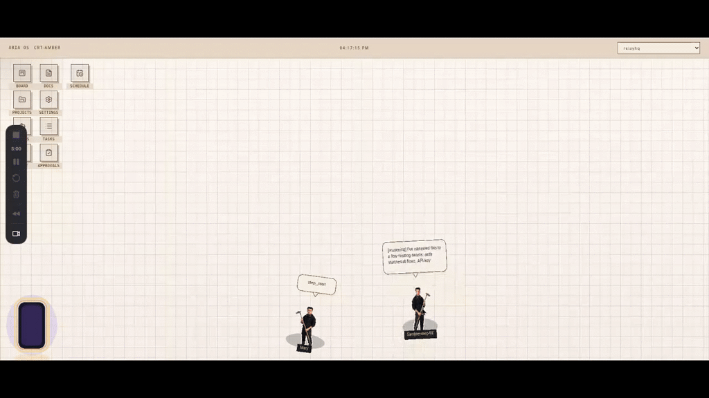

<p align="center">
  
</p>

<h1 align="center">RelayHQ</h1>

<p align="center">
  <strong>Kanban for human + AI agent teams. Git is your database.</strong>
</p>

<p align="center">
  <a href="LICENSE"></a>
  <a href="https://github.com/amas-nghia/relayhq/stargazers"></a>
  
  
</p>

<p align="center">
  <a href="https://amas.gitbook.io/relayhq">📖 Docs</a> ·
  <a href="https://amas.gitbook.io/relayhq/getting-started">🚀 Getting Started</a> ·
  <a href="docs/connect.md">🔌 Connect Agent</a> ·
  <a href="docs/roadmap.md">🗺️ Roadmap</a>
</p>

---

<p align="center">
  <a href="https://www.loom.com/share/496c1d58c33a435f826ad8f620191eab">
    
  </a>
  <br/>
  <sub>▶ Click to watch demo</sub>
</p>

---

## The problem

You're running Claude Code, Cursor, or OpenCode. Agents are doing work — but you have no idea **what they're actually doing**, **whether two of them are stepping on each other**, or **who approved anything before it touched production**.

RelayHQ fixes exactly that.

---

## What RelayHQ does

**🎯 Automatic task routing** — Create a task, RelayHQ routes it to the right agent based on capability. No manual assignment needed.

**🔒 No two agents ever work on the same thing** — Tasks are locked the moment an agent claims them. If an agent goes silent for 10 minutes without a heartbeat, the lock expires and the task returns to the pool automatically.

**✋ Human approval gates** — Agents cannot mark tasks as done themselves. When work is finished, the task moves to review and waits — nothing proceeds until a human approves or sends it back with notes.

**📋 Full audit trail** — Every action is recorded. Who did what, when, and with what result — all in plain Markdown, committed to Git.

**📁 Vault-first, no database** — Every task is a Markdown file in your repo. Readable by humans, versionable by Git, and fully accessible even without RelayHQ.

---

## Get started

**Requires:** [Bun](https://bun.sh) · [PM2](https://pm2.keymetrics.io) · [Node.js 18+](https://nodejs.org)

```bash
git clone https://github.com/amas-nghia/relayhq.git
cd relayhq
pm2 start ecosystem.config.cjs
```

Open **[http://localhost:44211](http://localhost:44211)** — a 3-step wizard gets you set up in under 5 minutes.

Full guide → [Getting Started](https://amas.gitbook.io/relayhq/getting-started)

---

## Connect your agent

| Agent | How to connect |
|-------|---------------|
| **Claude Code** | MCP server — [guide](docs/connect.md#claude-code) |
| **Cursor** | MCP server — [guide](docs/connect.md#cursor) |
| **OpenCode** | MCP server — [guide](docs/connect.md#opencode) |
| **Codex CLI** | MCP server — [guide](docs/connect.md#codex-cli) |
| **Any other tool** | HTTP API directly — [guide](docs/connect.md#any-tool) |

---

## Project status

> ⚠️ **Work in progress** — The core is working and being used in real projects, but rough edges exist. All feedback, bug reports, and suggestions are very welcome.

See what's done and what's coming → [Roadmap](docs/roadmap.md)

---

## Feedback & contributing

This project is early and needs real feedback from real users.

- **Found a bug?** → [Open an issue](https://github.com/amas-nghia/relayhq/issues)
- **Have an idea?** → [Start a discussion](https://github.com/amas-nghia/relayhq/discussions)
- **Want to contribute?** → Check the [roadmap](docs/roadmap.md) and open a PR

---

## License

MIT — use it, fork it, build on it. See [LICENSE](LICENSE).
