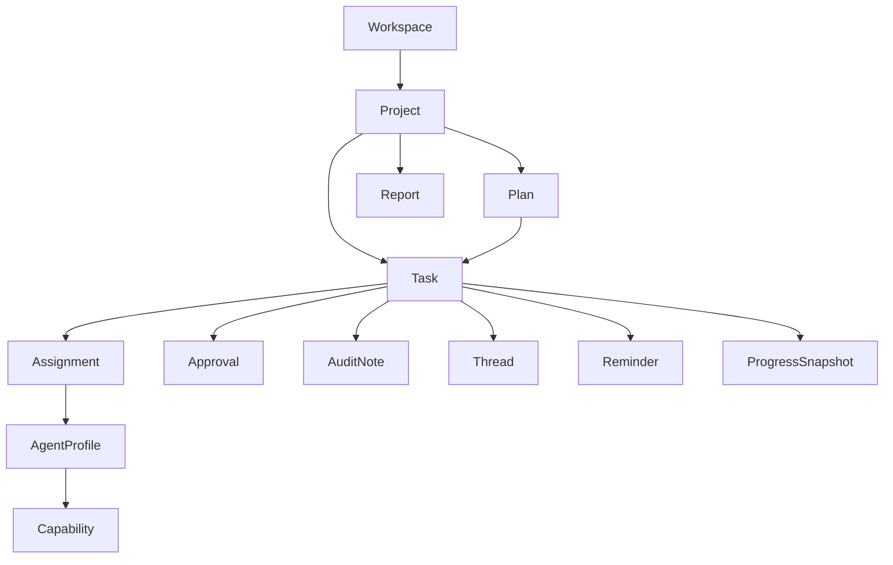

# Domain Model

RelayHQ is a control plane: it tracks work, ownership, approvals, and history without doing the work itself.

## At a glance

## Central now

These are the core entities for Phase 1.

| Entity | Responsibility | Relationships |
|---|---|---|
| Workspace | Top-level boundary for one team/org and its data | Contains projects and scopes everything else |
| Project | A container for a unit of coordinated work | Owns tasks, plans, approvals, notes, and history |
| Task | The atomic unit of work | Belongs to a project; may belong to a plan; can have assignments, approvals, notes |
| Assignment | Who is currently responsible for a task | Points to a human or agent; records ownership and handoff history |
| Approval | A decision gate for risky or important actions | Attached to a task or action; records request, approver, outcome |
| Audit note | Append-only record of what happened and why | Attached to tasks, assignments, approvals, or projects |

## Future extensions

These fit the model, but are not the minimum core.

| Entity | Responsibility | Relationships |
|---|---|---|
| Plan | An ordered or grouped view of work inside a project | Contains tasks; useful when tasks need sequencing |
| Thread | Conversation around a task, approval, or project | Holds coordination discussion and context |
| Reminder | Scheduled follow-up or nudge | Usually attached to a task, approval, or thread |
| Progress snapshot | Point-in-time status summary | Captures progress for task, plan, or project |
| Report | Stakeholder-facing summary | Derived from project/task activity |
| Agent profile | Durable identity for an agent | Used for assignment and capability matching |
| Capability | A skill, permission, or behavior tag for an agent | Belongs to an agent profile |

## Relationship rules

- A **workspace** owns many **projects**.
- A **project** owns many **tasks** and may also contain **plans**.
- A **plan** organizes tasks; a task can exist with or without a plan.
- A **task** is the main unit of execution and coordination.
- An **assignment** names the current responsible actor for a task.
- An **approval** blocks or unlocks a task/action until someone decides.
- An **audit note** is immutable context: what happened, who did it, and why.
- A **thread** is discussion; an **audit note** is the durable record.
- A **reminder** is time-based attention; it does not change work state.
- A **progress snapshot** summarizes state at a moment in time.
- A **report** is synthesized output for humans outside the work stream.
- An **agent profile** describes who an agent is; **capabilities** describe what it can do.

## Example flow

1. A **workspace** contains a **project**.
2. The project gets a **plan** and several **tasks**.
3. A task receives an **assignment** to a human or agent.
4. The task needs approval, so an **approval** is opened.
5. The decision and rationale are captured in an **audit note**.
6. Later, a **progress snapshot** and **report** summarize status.

## Model boundary

RelayHQ stores the coordination layer, not the execution layer.

It should answer:

- What is being worked on?
- Who owns it?
- What needs approval?
- What happened and why?
- What should happen next?

## Current vs future

**Central now**

- workspace
- project
- task
- assignment
- approval
- audit note

**Future extensions**

- plan
- thread
- reminder
- progress snapshot
- report
- agent profile
- capability
